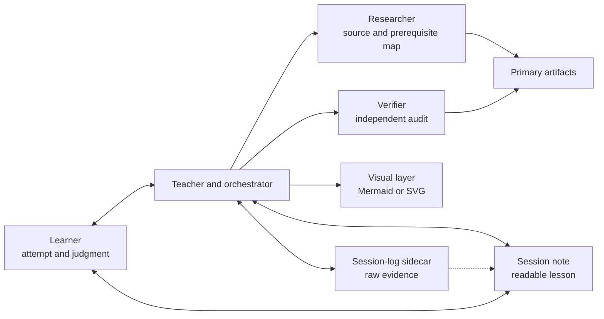
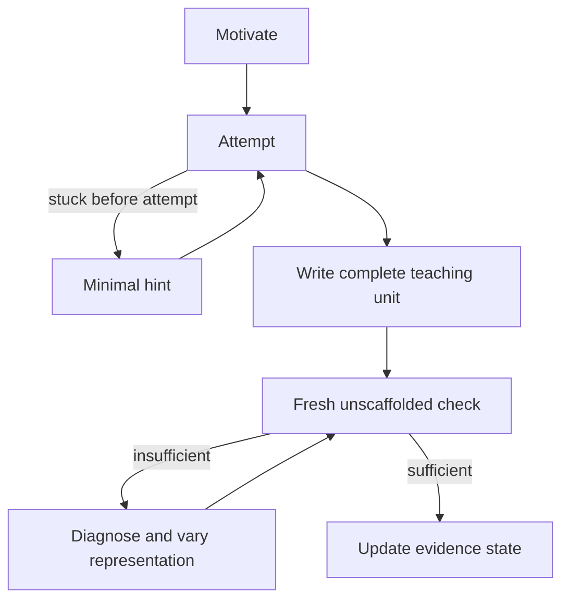

# AI learning system — portable specification

This is the provider-neutral handoff for [[Learning System]]. It defines the
behavior that must survive if the current implementation moves away from
[[Codex Learning System|Codex]]. Provider-specific commands, configuration
formats, and UI widgets are adapters; this protocol is the system.

## Objective

Produce independent capability: Farhan can retrieve, explain, construct,
apply, test, and adapt the target knowledge on a novel problem.

Maximize productive subject-matter struggle:

- prediction and retrieval;
- construction, derivation, tracing, and debugging;
- explanation and discrimination;
- novel transfer.

Minimize logistical struggle:

- locating and organizing sources;
- maintaining the session note and learner map;
- selecting the next diagnostic or teaching step;
- drawing the dependency plan;
- recording feedback and retrieval dates.

AI is an interface to sources and feedback, not the source of truth. The
learner retains judgment and must perform the cognitive work.

## Architecture



Inspect the separation: research and verification advise the teacher, while
neither replaces the primary artifact or the learner's attempt.

### Roles

- **Learner:** chooses the capability, answers probes, attempts each node,
  explains reasoning, performs transfer, and makes final judgments.
- **Teacher/orchestrator:** maintains state, selects questions, controls
  feedback timing, plans dependencies, teaches one node at a time, and updates
  the note.
- **Researcher:** maps only goal-relevant prerequisites, mechanisms,
  assumptions, common confusions, and primary or authoritative sources.
- **Verifier:** independently audits diagnostic items, keys, evidence labels,
  dependency edges, teaching claims, and visual semantics.
- **Persistence layer:** keeps a readable learner-facing session note and a
  linked teacher-facing evidence log in plain Markdown.

Research and verification should use separate contexts for consequential
topics. They must not inherit the teacher's conclusion as a premise.

## Evidence policy

Use this source hierarchy:

1. learner-supplied course material, code, data, or other original artifact;
2. official documentation, specifications, textbooks, original research, and
   executable tests appropriate to the subject;
3. secondary explanations only when they add a useful perspective and do not
   replace verification;
4. AI output, summaries, dashboards, and search snippets only as leads.

Keep facts, inferences, recommendations, and unknowns distinct. Preserve
definitions, units, configurations, assumptions, boundaries, and dates when
they affect correctness. Use `Known / Inference / Unknown / To verify` when
evidence is incomplete.

### Learner evidence states

| State | Required evidence |
| --- | --- |
| `unknown` | No reliable evidence yet |
| `introduced` | Encountered or explained, without successful production |
| `supported` | Recognition or scaffolded production succeeded |
| `demonstrated` | Unscaffolded production or novel transfer succeeded |

Confidence is metadata, never evidence. Recognition alone cannot establish
`demonstrated`. A state may be downgraded when later evidence contradicts it.

## Durable session state

Use [[Learning Session Template]] plus [[Learning Session Log Template]], or
reproduce this two-artifact structure in plain Markdown.

The **learner-facing session note** contains:

1. **Goal:** independent capability and explicit exclusions.
2. **Source pack:** primary artifacts, supporting sources, and verification
   method.
3. **Learner map:** strand, verified floor, observed ceiling, misconception or
   uncertainty, evidence type, and state.
4. **Dependency plan:** editable Mermaid DAG, edge rationales, current node,
   and current state.
5. **Lessons:** one complete explanation and active check per dependency
   node, plus targeted reteaching when needed.
6. **Transfer and retrieval:** novel application, verified result, retrieval
   date, and later discrimination/interleaving date.

The linked **teacher-facing session log** contains raw diagnostic questions,
learner responses, assessments, agent/process notes, and protocol events. Name
it `<session title> — Session Log.md`; link the two artifacts through
`session-log` and `session-note` properties. The main note must not contain a
`## Session log` section. A provider resuming a legacy note must move that
section losslessly into the sidecar before continuing.

The structured session-note sections are the current state. The sidecar is
supporting evidence, not a substitute for the learner map or lessons.

### Retrieval v1 state

New sessions use protocol `2026-08-26.1` and carry these session-note
properties: `retrieval-schema: "1"`, `retrieval-enabled: true`,
`retrieval-timezone: America/Detroit`, `retrieval-started`, `retrieval-stage`,
`retrieval-required-passes: 2`, `retrieval-passes`, and `next-retrieval`.
At same-day closeout, `retrieval-started` is that local calendar date, stage is
`initial`, passes are `0`, and `next-retrieval` is two calendar days later.

The `## Transfer and retrieval` section preserves the novel application and
result/verification. Its one `### Delayed retrieval` subsection has the
completion criterion, current stage, next retrieval, and exact answer-hidden
production prompts under `#### Initial retrieval prompt` and
`#### Interleaved retrieval prompt`. Raw delayed-retrieval responses,
assessments, and history remain in the linked sidecar. Put the closeout's
`Known / Inference / Unknown / To verify / Smallest next action` fields after
the prompts under a separate `### Evidence boundary` heading so they can never
be emitted as part of a learner-facing prompt.

## Interaction contract

- Ask exactly one learner-facing question or request per turn.
- Do not teach multiple dependency nodes in one response.
- Record diagnostic questions in the sidecar before presenting them. Record a
  complete Phase 3 teaching unit in the learner-facing note before presenting
  its explanation and active check.
- After the learner replies, record the response and assessment without
  rewriting learner-authored content; raw responses belong in the sidecar.
- Use `$...$` for inline mathematics and `$$` on separate lines for display
  mathematics in Obsidian. Do not use `\(...\)` or `\[...\]` as Markdown math
  delimiters. Put LaTeX environments inside a `$$` block. Use code blocks for
  executable structure.
- Do not treat agent progress, tool output, or verifier output as the learner's
  response.

When both a Markdown workspace and chat are available, the session note is the
canonical reading surface and chat is the interaction surface. During
teaching, write the complete lesson under `## Lessons`; chat points to that
node and repeats its active check verbatim instead of generating a condensed
second explanation. Apply the same rule to Phase 2 plans and Phase 4 transfer
tasks: point to the canonical section and copy any active request verbatim.
Accept answers and approvals in chat. If the learner requests full content in
chat, copy it exactly from the note.

For delayed retrieval, the provider finds due eligible notes, chooses the
oldest/most overdue one deterministically, and reveals exactly one current
prompt without its answer in the interaction surface. Before grading, reread
the source pack, learner map, and completed lesson. After the learner responds,
give a source-grounded correction and write raw evidence to the sidecar.
Exclude synthetic harnesses and disabled sessions. The session note remains the
canonical reading surface; chat or CLI remains the answer surface.

## Phase 0 — Establish

Identify before diagnosis:

1. the independent capability;
2. what is out of scope;
3. the active session note;
4. relevant course material, documentation, code, data, or other source
   artifacts;
5. constraints such as course policies, allowed techniques, notation, and
   assessment format.

If no session note exists, check for a durable topic note before creating a
distinct session note. Link related notes rather than duplicating them.

Translate the request into an observable independent capability. If two
plausible interpretations would change the prerequisite graph, transfer task,
or exclusions, ask one ungraded clarification question before probing. Do not
invent a precise goal from a materially ambiguous request.

## Phase 1 — Research and probe

For a nontrivial topic, ask the researcher to return:

- scope and exclusions;
- goal-relevant prerequisite strands;
- definitions, mechanisms, invariants, and assumptions;
- candidate dependencies;
- confusions worth probing;
- direct source paths or URLs beside supported claims;
- unknowns and the artifact needed to resolve them.

Ask the verifier to audit the initial probes, consequential answer keys,
assumptions, distractors, and whether each question tests the intended
construct.

For each goal-relevant strand:

1. Establish a floor with one meaningful success.
2. Jump substantially harder until a miss or honest `I don't know` establishes
   a ceiling.
3. Narrow that bracket with a fresh item that distinguishes a slip, isolated
   gap, and systematic misconception.
4. Stop when another probe would not change the first teaching node.

Floor, ceiling, and confirmation are evidence roles, not a mandatory three
items per strand. Reuse valid cross-strand evidence and skip a confirmation
that cannot change the first teaching node.

Adapt the learner-facing diagnostic budget to the scope and answer pattern:

- narrow skill or definition: usually 4–7 probes;
- typical technical concept: usually 8–14;
- broad, prerequisite-heavy topic: 12–18 and preferably split into smaller
  goals.

There is no minimum. Stop earlier after consistent evidence or whenever
another answer would not change the first teaching node. Patchy evidence and
consequential suspected misconceptions justify the upper end. Do not exceed 18
probes in one sitting without explicit learner agreement. At the cap, preserve
unknowns and split the goal or diagnose remaining dependencies just in time.

Use a hybrid diagnostic funnel:

1. Begin each strand with one broad, single-select multiple-choice item. Use
   parallel bare answer claims, plausible diagnostic distractors, varied answer
   position, and an `I don't know` option; require one letter only.
2. Adapt difficulty with single-select items until the likely boundary is
   narrow. Trace, code, and application scenarios can remain multiple choice
   when each option specifies a complete outcome.
3. At a consequential or uncertain boundary, require one atomic constructed
   response—one state, prediction, invariant, explanation sentence, code
   fragment, derivation step, or model. Do not bundle distinct outputs into a
   multipart response.
4. When application is part of the goal and the result could change the plan,
   use one unfamiliar integration prompt requesting only the smallest
   discriminating output rather than a full solution by default.

Phase 1 must not request a full multi-component contract such as
`vertex | transitions | source | goal`. Select one component that can change
the first teaching node. Reserve integration of the complete session goal for
transfer; a Phase 3 check may integrate only its current node's components.

Selected-response success is at most `supported`. Unscaffolded construction
may demonstrate only the exact construct exposed; the later transfer task is
still required for the independent capability.

Defer corrective feedback while it could contaminate a coupled diagnostic
strand. If feedback is revealed early, label later evidence
`post-instruction` and require a fresh non-isomorphic item.

## Phase 2 — Verify and plan

Run a fresh independent audit of:

- the learner map and its evidence labels;
- consequential question keys;
- proposed foundations;
- dependency edges;
- transfer-task alignment.

The verifier returns one status per material item:

- `VERIFIED`: supported, with source and scope;
- `REVISE`: incorrect or weak, with correction and source;
- `AMBIGUOUS`: multiple interpretations remain defensible;
- `UNKNOWN`: the necessary artifact is missing.

Invalidate evidence affected by `REVISE` or `AMBIGUOUS`, correct the item
against its source, and re-probe with a fresh item. Do not average unresolved
objections into a score.

Build the smallest useful directed acyclic graph from demonstrated knowledge
to the independent capability. Classify each proposed root as `demonstrated`,
`foundation to teach`, or `derived`. Stress-test it for hidden conditions and
caveats; a derived claim requires its simpler dependency below it. Every root
must already be demonstrated or be taught and checked first. Every edge needs
a short rationale explaining the dependency.

Persist a `Root audit:` table immediately above the dependency graph with one
row per zero-indegree node and these columns: `Root`, `Classification`,
`Conditions / caveats`, and `Evidence or establishment`. In the final graph,
each audited root must be `demonstrated` or `foundation to teach`; a root still
classified as `derived` exposes a missing dependency and must be repaired.

Present and write to the note:

1. learner map: a compact Mermaid evidence-frontier summary followed by the
   precise table of known, boundary, misconceptions, unknowns, evidence types,
   and statuses;
2. selected approach and why it fits this learner and outcome;
3. editable Mermaid dependency graph;
4. edge rationales and sources;
5. planned transfer task and retrieval prompts.

Stop for explicit learner approval. Do not begin the first node in the
planning response.

## Phase 3 — Teach exactly one node

Show the current node and remaining path, then perform this state machine:



1. **Discovery turn:** motivate the node and require exactly one cold
   prediction, construction, trace, derivation, debug, distinction, or
   explanation before revealing the central move. A minimal hint is allowed
   only while the learner is stuck before making an attempt.
2. **Teaching/check turn:** after the attempt, whether right or wrong, write
   and reread a complete learner-facing teaching unit before replying. Never
   respond with only a correction or hint unless the learner explicitly asks
   for that.
3. **Required unit:** include the cold-attempt assessment, reusable rule or
   invariant, derivation, worked example or contrast, dependency connection,
   verification, and exactly one fresh answer-hidden production check.
4. **Freshness:** the check must be non-isomorphic to any disclosed example;
   asking the learner to restate a revealed answer is not transfer evidence.
5. **Persistence and hierarchy:** put the teaching unit in `## Lessons` in the
   main note before chat. Use one level-three heading per taught node and
   level-four headings for its required elements; do not add empty future-node
   headings. Put raw attempts and assessments in the sidecar.
6. **Update:** mark the node `introduced` after teaching. On a failed check,
   append a concise reteach block with the exact error, a materially different
   representation or example, and one fresh check. On success, update the
   evidence state in both the node and learner map, then stop before teaching
   the next node.

Correctness and economy are separate. For state modeling, require a
future-sufficient representation; describe redundant derivable fields as
correct but non-minimal when the transition contract remains consistent.

On a failed check, preserve every component already produced correctly and
request only the unresolved component next. Repeat the full integrated output
only when consistency between components is the error. After two misses on one
construct, reduce the response schema and change to a concrete trace, table,
diagram, typed signature, or executable example.

The chat response contains the current node/path, the exact lesson heading,
and the same active check copied verbatim. It does not paraphrase the lesson
into a competing version.

## Phase 4 — Transfer and calibration

After the sink node:

1. Require a novel application without step-by-step scaffolding.
2. Verify the result using a primary artifact, test, derivation, data, or
   counterexample.
3. Ask for a compressed explanation connecting the graph roots to the goal.
4. Author two exact answer-hidden production prompts: initial retrieval and a
   later interleaved/discriminating prompt.
5. At local closeout, set `retrieval-started` to the current local date and
   schedule the initial prompt for two calendar days later.
6. Close with `Known / Inference / Unknown / To verify` and the smallest next
   action.
7. Set both artifacts to `awaiting-retrieval`. The retrieve workflow, not the
   same-day teaching workflow, owns later state changes and can mark
   `complete` only after committed delayed evidence is validated.

### Delayed retrieval policy

An initial pass schedules the interleaved prompt from the actual local
assessment date plus five calendar days. A partial response retries the same
stage after two days; a miss retries it after one; an ungradable response does
not advance. An interleaved pass completes the session only when two committed
passes appear in order and strictly after `retrieval-started`.

The +2 / +5 / +2 / +1 intervals are transparent product defaults, not claims
of scientific optimality for every learner or topic. Retrieval practice and
spacing have supporting evidence; corrective feedback is supported in
computer-based-learning research; interleaving should be used cautiously and
where the material supports meaningful discrimination. See the direct sources
in [[Learning Research Sources]].

## Visual contract

- The Phase 2 dependency plan always uses an editable Mermaid `flowchart`.
- For graphs, BFS/DFS, state machines, flows, geometry, and changing traces,
  include at least one explanatory visual in every taught node. A repeated miss
  about edges or state transitions should receive a new visual representation
  in the first reteach unless a table or executable trace is clearer.
- An answer-hidden graph check may visualize only the supplied input topology
  and labels. Do not reveal the composite state graph, chosen path, or solution
  before the learner attempts it.
- For other subjects, use additional Mermaid only when it reduces conceptual
  load.
- Use a self-contained SVG for geometry, coordinates, vectors, physical
  layouts, plots, or custom traces Mermaid cannot express clearly.
- Do not create decorative visuals. A table, equation, prose, or code is often
  the better representation.
- Verify arrow direction, labels, scale, states, clipping, and domain
  semantics. A correct render does not prove the represented claim.
- SVG must contain no scripts, event handlers, `foreignObject`, external
  references, embedded data URLs, doctypes, or entities.

## Provider capability and fallback contract

| Capability | Preferred behavior | Honest fallback |
| --- | --- | --- |
| Persistent file access | Update the Obsidian note directly | Return a complete Markdown patch and state that persistence requires the learner |
| Parallel agents | Separate researcher and verifier contexts | Run sequential fresh-context passes; label independence as weaker |
| Web or source retrieval | Inspect direct authoritative artifacts | Use supplied local artifacts; mark unsupported claims `Unknown` |
| Mermaid rendering | Store editable Mermaid and inspect the render | Store Mermaid source and ask the learner to report renderer errors |
| SVG preview | Render and visually inspect before embedding | Provide safe SVG source and label visual inspection incomplete |
| Delayed scheduling | Schedule retrieval if authorized | Write exact prompts and dates in the note |

Never claim a source, write, render, verification, independent audit, or test
occurred unless it actually occurred.

## Portable startup prompt

Give a replacement AI this note and say:

```text
Follow [[AI Learning System — Portable Specification]] as the governing
learning protocol. I want to learn [topic] well enough to [independent
capability]. Use [session note] as durable state. Begin with Phase 0, inspect
the named sources, and ask only one learner-facing question per turn. Do not
teach until diagnosis, independent verification, a Mermaid dependency plan,
and my explicit approval are complete.
```

If the provider cannot access the vault, export this specification,
[[AI Learning Contract]], [[Learning Session Template]], and the relevant
source artifacts together.

## Migration checklist

1. Copy this specification and [[AI Learning Contract]].
2. Preserve the Markdown session schema and Obsidian backlinks.
3. Implement an explicit `teach` entry point using the four phases above.
4. Create separate researcher and verifier roles with the stated outputs.
5. Implement the visual contract; Mermaid source is the minimum requirement.
6. Map each provider capability to the fallback table without overstating what
   is available.
7. Run the acceptance tests before trusting the new adapter.

## Acceptance tests

A provider adapter passes only if it can demonstrate all of these on a small
topic:

- activates the protocol explicitly and identifies goal, scope, note, and
  source pack;
- asks one ungraded clarification when a vague goal has plan-changing
  interpretations, but adds no clarification ceremony to a concrete goal;
- asks one atomic diagnostic question per learner turn and never bundles
  several response fields;
- never uses a full state-graph contract as a Phase 1 constructed probe;
- combines efficient selected-response screening with a targeted constructed
  check at a consequential or uncertain boundary;
- brackets a floor and ceiling without teaching through the diagnosis;
- adapts probe count to topic scope and plan-changing uncertainty, stops early
  when the first node is clear, and requires explicit learner agreement beyond
  18 probes in one sitting;
- records evidence type separately from confidence;
- performs an independent verification pass and handles an invalid item;
- classifies and stress-tests every dependency root instead of treating a
  disguised derived claim as an unconditional foundation, and the deterministic
  validator rejects a missing, incomplete, or graph-mismatched root audit;
- creates a valid Mermaid DAG with sourced edge rationales;
- creates a valid Mermaid learner-map summary without replacing the precise
  evidence table;
- uses parser-safe node IDs and, when a local parser exists, successfully
  parses the exact Mermaid source before claiming validation;
- renders mathematical notation with the target Markdown surface's supported
  delimiters and rejects raw `\(...\)` or `\[...\]` delimiters in Obsidian;
- waits for approval before teaching;
- writes the learner-facing node before replying, with exactly one level-three
  node heading, a status callout, and the seven required level-four lesson
  headings;
- requires a cold attempt, then provides a complete lesson rather than a
  correction-only reply;
- copies the note's answer-hidden, non-isomorphic active check exactly into the
  CLI and records the raw response and assessment in the linked sidecar;
- keeps learner-map status, node-callout status, and evidence language
  consistent; recognition or scaffolded evidence is never called
  `demonstrated`;
- refuses to advance after insufficient evidence, changes representation on
  reteaching, preserves proven components, isolates the unresolved output,
  makes the newest append-only reteach check canonical, and does not teach a
  child node in the same turn;
- distinguishes a future-sufficient state from a preferred minimal state;
- uses explanatory visuals by default for structural lessons and does not leak
  the answer through an active-check visual;
- preserves learner-authored responses while keeping the raw session log out
  of the learner-facing note;
- verifies a novel transfer task;
- writes delayed retrieval prompts and dates;
- moves a same-day finished session to `awaiting-retrieval` and passes a
  deterministic closeout validation distinct from active-check validation;
- selects exactly one due prompt without revealing its answer, records delayed
  retrieval evidence only in the sidecar, reschedules it from observed
  performance, and rejects `complete` unless ordered delayed-pass evidence is
  verifiable;
- accurately reports any unavailable capability or incomplete check.

## Current Codex adapter

As of 2026-08-26, the local implementation maps this specification to:

- `.agents/skills/teach/SKILL.md` — teacher/orchestrator protocol;
- `.agents/skills/learning-visuals/SKILL.md` — visual contract;
- `.codex/agents/learning-researcher.toml` — Terra Medium researcher;
- `.codex/agents/learning-verifier.toml` — Terra High verifier;
- `.codex/agents/learning-visualizer.toml` — Luna Medium visual formatter;
- `Templates/Learning Session Template.md` and
  `Templates/Learning Session Log Template.md` — persistence schema;
- `.agents/skills/teach/scripts/validate_session.py` — deterministic structural,
  backlink, protocol-version, status, active-check synchronization, and
  same-day closeout checks; it delegates completed delayed-retrieval evidence
  checks to the retrieve helper when available.

These paths are implementation details. [[Codex Learning System]] explains how
to invoke the current Sol High teacher and the role-specific model adapter.

## Related

- [[Learning System]]
- [[AI Learning Contract]]
- [[Codex Learning System]]
- [[Learning Research Sources]]
- [[Learning Session Template]]
- [[Learning Session Log Template]]
- [[Vault Source Integrity Protocol]]
- [[CURRENT-STATE]]
