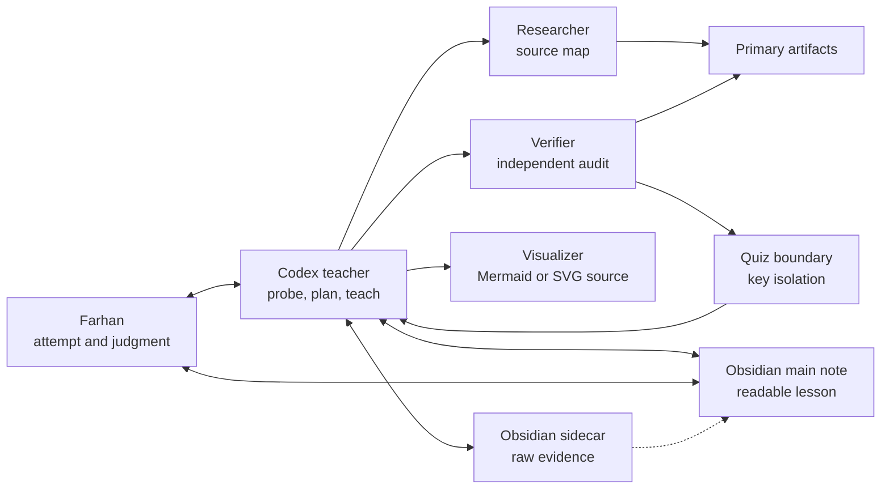

# Codex learning system

This is the Codex-native adapter for
[[AI Learning System — Portable Specification|the portable learning
protocol]]. Codex owns the teaching conversation, source coordination,
verification, visualization, and direct Obsidian updates. Farhan owns the
attempts, explanations, applications, and final judgment. Original artifacts
remain the sources of truth.

## Start a session

Open the vault in Codex and start a new local chat. A minimal request is:

```text
Use $teach. I want to understand BFS well enough to recognize and implement it
in unfamiliar graph problems. Use [[BFS - shortest-path application]] as the
session note.
```

If the note is empty, Codex initializes it from [[Learning Session Template]].
If no note is named, Codex checks for an existing topic note and creates a
distinct session note when the work is durable enough to keep.

There is no launcher, second login, linked-session command, or transcript
bridge. Codex keeps the readable lesson, evidence map, sources, plan, lessons,
and retrieval prompts in the active note. Raw questions, responses,
assessments, and process history go in a linked teacher-facing sidecar named
`<session title> — Session Log.md`.

Obsidian is the canonical reading surface; the Codex CLI is the interaction
surface. Read each node lesson and its visuals in Obsidian, then answer and
steer in the CLI. The CLI repeats the note's active check verbatim instead of
presenting a shorter competing explanation. If the note is edited directly,
tell Codex to reread it before assessing the next answer.

## System map



Inspect the separation: research and verification inform the teacher, while
neither replaces Farhan's attempt or the primary artifact.

## What `$teach` does

1. Establishes the independent capability, scope, source pack, and session
   note, asking one ungraded clarification only when ambiguity would change the
   plan.
2. Uses parallel researcher and verifier agents for nontrivial topics.
3. Inventories every strand needed for the full requested capability, then
   probes breadth before deepening uncertain boundaries. The coverage ledger
   distinguishes unprobed, floor-only, ceiling-only, bracketed, bounded, and
   deferred strands; choosing the first teaching node does not finish diagnosis.
   Probes each relevant prerequisite strand through a broad multiple-choice
   screen, adaptive selected-response items, and an atomic constructed check
   at the likely boundary. A Phase 1 construction requests one discriminating
   component, never a full multi-field contract. The verifier authors and registers keyed
   selected-response items behind the local quiz boundary and returns only an
   opaque ID; the teacher sees shuffled `A`–`T`/`0` display tokens and no key
   until submission.
4. Writes a precise learner-map table, a compact Mermaid evidence-frontier
   summary, and an editable Mermaid dependency DAG; classifies and stress-tests
   every root, explains why the first node is reachable but nontrivial, names
   its task-relevant feedback signal, then waits for approval.
5. Teaches exactly one node at a time: one cold attempt, then a complete
   persisted lesson with a rule, derivation, worked contrast, dependency
   connection, verification, and one fresh unscaffolded check. Reteaching keeps
   correct components fixed and isolates the unresolved output. Discovery and
   active checks sit at the learner's evidence frontier: overloaded tasks are
   split, while mechanically easy checks become more discriminating.
6. Requires a novel transfer task, records delayed retrieval prompts, and
   closes the same-day session as `awaiting-retrieval`.

These choices use flow-compatible conditions
as task-design heuristics. `$teach` does not promise, measure, or optimize the
feeling of flow; observable production, verification, transfer, and delayed
retrieval remain the success criteria.

## What `$retrieve` does

`$retrieve` continues a closed `2026-08-26.1` learning session without
re-teaching it. It scans eligible `awaiting-retrieval` notes, excludes
synthetic harnesses and disabled sessions, and deterministically selects the
oldest overdue due note. It reveals exactly one current, answer-hidden prompt
in the CLI. Before grading, the teacher rereads that note's source pack,
learner map, and completed lesson; after the response it gives a
source-grounded correction and writes the raw prompt, answer, assessment,
observed local date, and scheduling decision to the linked sidecar.

State changes are performance-based: an initial pass advances to an
interleaved/discriminating prompt due five calendar days after the observed
assessment date; a partial response retries the same stage in two days; a miss
retries it in one; an ungradable response does not advance. An interleaved
pass completes the session only after the validator can verify two committed
passes in order, both strictly after `retrieval-started`. The +2-day initial
schedule and these later intervals are product defaults, not universal optimum
claims. [[Learning Research Sources]] records the supporting retrieval,
spacing, corrective-feedback, and qualified-interleaving evidence.

The dependency plan always has a Mermaid visual. During graph, state-machine,
flow, geometry, or trace-heavy teaching, `$learning-visuals` is default-on for
every node and for reteaching a structural misconception. An answer-hidden
check may show the supplied input graph but never its solution state graph or
path.
Each instructional Mermaid or SVG is rendered to a staged PNG, inspected with
the image viewer, published only with a receipt approving those exact bytes,
and inspected again at its final path. The note embeds the PNG and links the
editable `.mmd` or `.svg`; failed or unavailable inspection blocks publication.

Every planned lesson also names the concept relationship to visualize and its
best form. The teaching node delivers that graph, trace, plot, chart, or spatial
SVG beside the explanation. Learning maps do not count as explanatory lesson
visuals. Each node declares `Visual: embedded`, `alternative`, `not-needed`, or
`incomplete`, with a concrete reason. New-session validation checks that a
declared embedded visual actually has a local PNG inside the explanation;
the teacher still inspects its rendering and verifies its meaning.

The 2026-09-05 revision adds `diagnostic-coverage: "1"` and
`lesson-visuals: "1"` to new sessions. It does not rewrite older learner
evidence or change retrieval protocol `2026-08-26.1`.

## Model routing

| Role | Model | Reasoning | Boundary |
| --- | --- | --- | --- |
| Teacher/orchestrator | Active parent-session model | Session setting | Owns learner state, diagnosis, planning, and teaching |
| Researcher | `gpt-5.6-terra` | `medium` | Reads and distills primary or authoritative sources |
| Verifier | `gpt-5.6-terra` | `high` | Challenges keys, evidence, claims, edges, and visuals |
| Visualizer | `gpt-5.6-luna` | `medium` | Formats a verified brief without choosing semantics |

The teacher model follows the active session; it is not pinned by this skill. Specialist model and
reasoning settings are pinned in their custom agent files. This split reduces
Sol use for supporting work, but it does not remove account limits: every
subagent consumes model work, and the loop cannot generate new instruction if
the parent session itself is unavailable. A specialist availability failure
caused by a usage limit or unavailable model is not retried; a transient spawn
failure gets at most one retry before the documented degraded fallback.

## Evidence levels

| Status | Meaning |
| --- | --- |
| `unknown` | No reliable evidence yet |
| `introduced` | The idea has been explained or encountered |
| `supported` | Recognition or scaffolded production succeeded |
| `demonstrated` | Unscaffolded production or novel transfer succeeded |

Confidence is recorded only as learner metadata. It never upgrades an evidence
status.

## Boundaries

- Multiple choice is a fast diagnostic, not proof of mastery.
- Diagnostic responses are atomic: one letter, state, prediction, invariant,
  explanation sentence, code fragment, derivation step, or model per turn.
  Several outputs are not bundled into one Phase 1 prompt; integration of the
  complete session goal is reserved for transfer.
- Probe counts adapt to the topic and evidence rather than serving as a quota:
  roughly 4–7 for a narrow skill, 8–14 for a typical technical concept, and
  12–18 for a broad prerequisite-heavy topic. Stop when all relevant strands
  are bracketed/bounded. At the cap, explicitly defer unresolved strands and
  label the plan provisional; never exceed 18 in one sitting without explicit
  learner agreement. More questions alone do not establish better coverage.
- Selected-response success is at most `supported`; targeted unscaffolded
  production can demonstrate only the exact construct it exposes.
- Feedback stays deferred while it could contaminate another diagnostic
  strand.
- Search results and AI output are leads. Durable claims cite inspected source
  artifacts.
- Mermaid uses Obsidian-safe `n_...` node IDs and avoids reserved keywords.
  When a local parser exists, the exact source must parse successfully before
  the teacher claims validation or writes it into the note.
- Learner-facing math uses Obsidian-native `$...$` inline delimiters and
  `$$...$$` display blocks; `\(...\)` and `\[...\]` are rejected before the
  teacher points Farhan to the note.
- The main note is a readable learning artifact, not a transcript. Complete
  lessons belong there; raw questions, responses, assessments, and
  process events belong in the linked teacher-facing session-log sidecar.
- After the initial attempt on a node, a correction-only or hint-only response
  is a protocol failure unless Farhan explicitly requested only a hint.
- A future-sufficient state may contain redundant fields; minimality is a
  separate modeling preference, not a truth condition.
- Same-day closeout uses `awaiting-retrieval` and the validator's closeout mode;
  `complete` is reserved for recorded delayed retrieval evidence.
- Subagents supply independent perspectives but consume additional model work.
  Use them for consequential research and verification, not ceremony.

## Implementation

- `.agents/skills/teach/` contains the repo-scoped teaching protocol.
- `.agents/skills/teach/scripts/session_factory.py` creates a reciprocal
  current-protocol note and sidecar from the canonical templates.
- `.agents/skills/teach/scripts/validate_session.py` checks the two-note
  contract and structured DAG-root audit, then emits the newest canonical
  active check—including a reteach check—for exact CLI reuse or validates a
  finished same-day session with `--require-closeout`.
- `.obsidian/snippets/learning-mermaid-responsive.css` keeps Mermaid SVGs
  within the current note pane in both Reading view and Live Preview.
- `.agents/skills/learning-visuals/` contains the visual decision and creation
  protocol plus the staged render/inspect/receipt-publish pipeline.
- `.agents/learning-quiz/` and project `.codex/config.toml` provide the local
  answer-hidden STDIO MCP boundary.
- `.agents/skills/teach/tests/`, `.agents/skills/retrieve/tests/`, and
  `.agents/skills/learning-visuals/tests/` contain deterministic protocol and
  lifecycle regression coverage.
- `.codex/agents/learning-researcher.toml`,
  `.codex/agents/learning-verifier.toml`, and
  `.codex/agents/learning-visualizer.toml` define read-only specialist agents
  with role-specific models.

The design was adapted from [Amos Blomqvist's learning
configuration](https://github.com/amosblomqvist/learn/tree/73eaf7c5a1a0c19217ba98580e4fc4de35841aa6)
after verifying that current Codex supports
[repo-scoped skills](https://learn.chatgpt.com/docs/build-skills) and
[project custom agents](https://learn.chatgpt.com/docs/agent-configuration/subagents).

## Related

- [[AI Learning System — Portable Specification]]
- [[Learning System]]
- [[AI Learning Contract]]
- [[Learning Research Sources]]
- [[Learning System Gap Closure — 2026-08-30]]
- [[Learning Session Template]]
- [[Learning Session Log Template]]
- [[CURRENT-STATE]]
