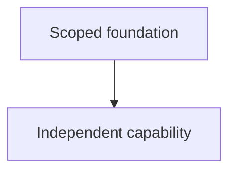

# {{title}}

## Goal

Independent capability:

Out of scope:

## Source pack

- Primary course/textbook/documentation artifact:
- Supporting sources:
- Verification method (source, test, derivation, data, or qualified feedback):

## Learner map

| Strand | Verified floor | Observed ceiling | Misconception or uncertainty | Evidence type | Status |
| --- | --- | --- | --- | --- | --- |

Current node:

Status: `unknown`

## Dependency plan

## Lessons

## Transfer and retrieval

- Novel application:
- Result and verification:
- Retrieve on:
- Interleave/discriminate on:

## Related

- [[Learning System]]
- [[AI Learning Contract]]
- [[AI Learning System — Portable Specification]]
- [[Codex Learning System]]
